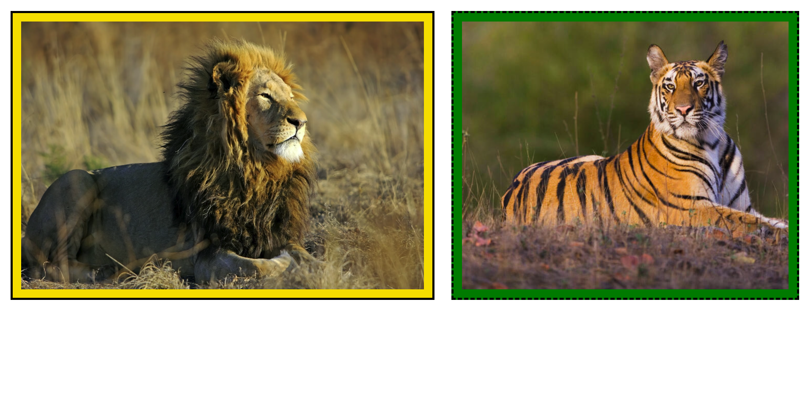

# ALFT: M4L2 - Warm Up

1. Recreate the page below using the box model and any necessary CSS properties. Don't worry if the images aren't on the same line.

Bonus: Finished early? Now, try to figure out how to get the images on the same line. Hint. Use flexbox.

## Image Reference

